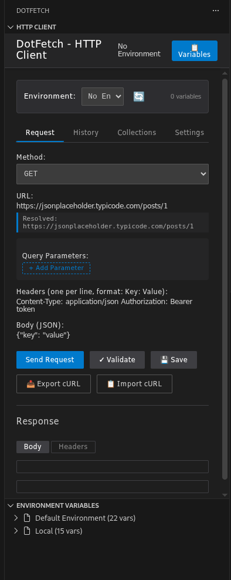
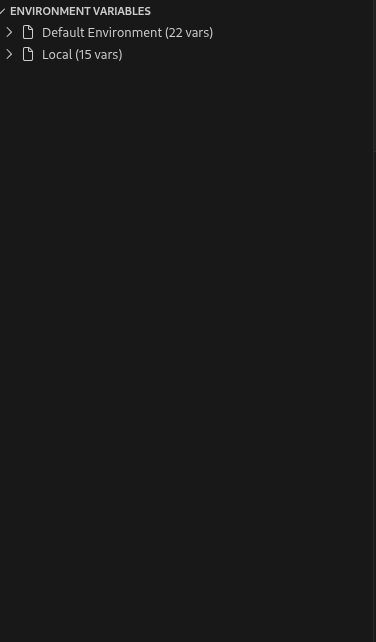
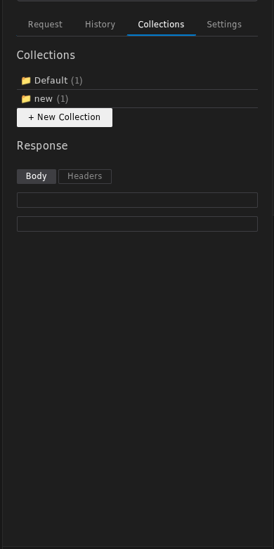
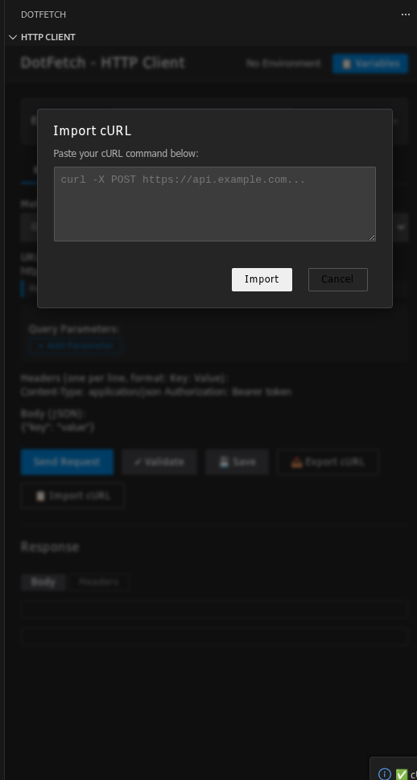

<div align="center">

# 🚀 DotFetch

**Professional HTTP Client for VS Code**

*Modern API Testing Made Simple*

[](https://marketplace.visualstudio.com/items?itemName=FreeRave.dotfetch)
[](https://code.visualstudio.com/)
[](LICENSE)

[📥 Install from Marketplace](https://marketplace.visualstudio.com/items?itemName=FreeRave.dotfetch) • [📖 Documentation](https://github.com/kareem2099/DotFetch) • [🐛 Report Issues](https://github.com/kareem2099/DotFetch/issues)

---

</div>

## ✨ What is DotFetch?

DotFetch is a **powerful, modern HTTP client** built specifically for VS Code. Designed for developers who demand the best tools for API testing, debugging, and development workflows.

**🎯 Key Benefits:**
- **Native VS Code Integration** - Seamless experience within your development environment
- **Environment Variables** - Full support for `.env` files with live substitution
- **Comprehensive Authentication** - API Key (Header & Query), OAuth 2.0 Client Credentials, Bearer Token, and Basic Auth
- **Developer-Friendly Security** - SSL/TLS verification toggle for localhost development, password visibility toggles, and safe non-persistent credential storage
- **Professional UI** - Dark theme optimized interface matching VS Code aesthetics with Response Body and Headers inspector tabs
- **Performance & Memory Protected** - 10MB payload size limits and large response truncation guards

> **v2.1.0 Runtime Verified**: DotFetch v2.1.0 has been runtime-verified across authentication, networking, persistence-security, response-limit, and SSL/TLS scenarios.

---

## 🚀 Quick Start

### Installation

1. **Install from VS Code Marketplace:**
   ```
   Ctrl+P → ext install FreeRave.dotfetch
   ```

2. **Or search in Extensions:**
   - Open VS Code
   - `Ctrl+Shift+X` (Windows/Linux) or `Cmd+Shift+X` (Mac)
   - Search for "DotFetch"
   - Click Install

3. **Reload VS Code** and you're ready to go!

### Your First Request

1. **Open DotFetch:** `Ctrl+Shift+P` → "DotFetch: Open HTTP Client"
2. **Enter URL:** `https://jsonplaceholder.typicode.com/posts/1`
3. **Select Method:** Choose from GET, POST, PUT, DELETE, etc.
4. **Send Request:** Click the Send button or press `Enter`

---

## 🎨 Features

### 🔧 Core HTTP Client

<table>
<tr>
<td width="50%">

**Complete HTTP & Auth Support**
- ✅ All HTTP Methods (GET, POST, PUT, DELETE, PATCH, HEAD, OPTIONS)
- ✅ **API Key Auth** (Header or Query Parameter with live preview)
- ✅ **OAuth 2.0** (Client Credentials flow with ⚡ direct token fetching)
- ✅ **Bearer Token** & **Basic Auth** (with `{{ENV}}` variable substitution)
- ✅ **Show/Hide Secret Toggles** (👁️ / 🙈)
- ✅ **SSL Toggle** for local `https://localhost` / self-signed certs
- ✅ Request Body (JSON, Text, Form Data)
- ✅ Structured Key-Value Headers & Query Parameters
- ✅ Configurable Timeout & Network Retry

**Advanced Request Features**
- ✅ Request Collections with one-click Save & Load
- ✅ Ephemeral Session Token handling (prevents secret leakage)
- ✅ Request Templates for reusability
- ✅ Request History with search & filters
- ✅ Request validation before sending
- ✅ Syntax highlighting for JSON bodies

</td>
<td width="50%">

**Response Analysis & Protection**
- ✅ Formatted JSON responses with syntax highlighting
- ✅ **Response Headers Inspector** (dedicated key-value table)
- ✅ Visual Payload Size & Time measurement
- ✅ **Large Response Guard** (protection against huge payloads)
- ✅ Advanced Error Explanations & cancellation support

</td>
</tr>
</table>

### 🌍 Environment Variables

<table>
<tr>
<td width="50%">

**Multi-Environment Support**
- ✅ `.env`, `.env.local`, `.env.development`
- ✅ `.env.production`, `.env.test`
- ✅ Automatic environment detection
- ✅ Environment switching

**Live Variable Substitution**
- ✅ `{{VARIABLE_NAME}}` syntax
- ✅ Real-time highlighting
- ✅ Pre-send validation
- ✅ Missing variable warnings

</td>
<td width="50%">

**Environment Tree View**
- ✅ VS Code sidebar integration
- ✅ Variable explorer
- ✅ Copy variable values
- ✅ Refresh environments

</td>
</tr>
</table>

### 📁 Collections & Organization

- ✅ **Request Collections** - Group requests by project/feature
- ✅ **One-Click Export** - Portable JSON backups
- ✅ **Request Annotations** - Save notes for documentation
- ✅ **Save & Load** - One-click request management
- ✅ **Collection CRUD** - Full create, read, update, delete operations

### 🔄 Import/Export

<table>
<tr>
<td width="50%">

**cURL Export**
- ✅ Generate complete cURL commands
- ✅ Include all headers & body
- ✅ Clipboard integration
- ✅ One-click copy

</td>
<td width="50%">

**cURL Import**
- ✅ Parse complex cURL commands
- ✅ Auto-extract method, URL, headers
- ✅ Smart body detection
- ✅ Error handling for malformed commands

</td>
</tr>
</table>

### 🎨 Professional UI/UX

- ✅ **Native Dark Theme** - Automatically syncs with VS Code's active theme
- ✅ **Customizable Shortcuts** - Record your own keybinds for common actions
- ✅ **Method Color Coding** - Visual HTTP method distinction
- ✅ **Responsive Design** - Works on all screen sizes
- ✅ **Loading States** - Visual feedback for all operations
- ✅ **Context Menus & Modals** - Professional fluid interactions

---

## 📸 Screenshots

<div align="center">

### Main Interface


### Environment Variables


### Request Collections


### cURL Import/Export


</div>

---

## 🛠️ Configuration

### Extension Settings

DotFetch contributes the following settings:

```json
{
  "dotfetch.timeout": {
    "type": "number",
    "default": 10000,
    "description": "Default request timeout in milliseconds"
  },
  "dotfetch.sslVerify": {
    "type": "boolean",
    "default": true,
    "description": "Enable SSL certificate verification (disable for localhost or self-signed certs)"
  },
  "dotfetch.autoSave": {
    "type": "boolean",
    "default": true,
    "description": "Automatically save requests to history"
  },
  "dotfetch.maxHistory": {
    "type": "number",
    "default": 50,
    "description": "Maximum number of requests to keep in history"
  }
}
```

### Environment Files

DotFetch automatically detects these environment files in your workspace:

```
.env                    # Base environment
.env.local            # Local overrides
.env.development      # Development specific
.env.production       # Production settings
.env.test            # Test environment
```

---

## 📖 Usage Guide

### Basic Request

1. **Open DotFetch** from the sidebar or command palette
2. **Enter URL** in the URL field
3. **Select HTTP Method** from dropdown
4. **Add Headers** (optional) - one per line: `Key: Value`
5. **Add Body** (optional) - JSON or text
6. **Click Send** or press `Enter`

### Using Environment Variables

1. **Create `.env` file** in your workspace root:
   ```bash
   API_BASE_URL=https://api.example.com
   API_KEY=your_secret_key
   ```

2. **Use in requests:**
   ```
   URL: {{API_BASE_URL}}/users
   Headers:
   Authorization: Bearer {{API_KEY}}
   ```

3. **Variables highlight** in real-time and validate before sending

### Managing Collections

1. **Create Collection:** Click "New Collection" → Enter name
2. **Save Request:** Fill request → Click "Save" → Select collection
3. **Load Request:** Expand collection → Click request name
4. **Organize:** Drag and drop to reorder collections

### cURL Operations

**Export to cURL:**
- Fill request details
- Click "Export cURL"
- Command copied to clipboard

**Import from cURL:**
- Click "Import cURL"
- Paste cURL command
- Click "Import" - fields auto-populate

---

## 🔧 Development

### Prerequisites

- Node.js 16+
- VS Code 1.74+
- TypeScript 5.0+

### Building & Verification

DotFetch uses automated quality gates alongside manual runtime verification.

```bash
# Install dependencies
npm install

# Development build (watch mode)
npm run watch

# Production build (bundles extension and webview)
npm run compile

# Type check
npm run typecheck

# Lint code
npm run lint
```

Runtime verification covers all authentication flows, networking behavior, credential persistence boundaries, response limits, and SSL/TLS handling.

### Project Structure

```
dotfetch/
├── src/
│   ├── extension.ts          # Main extension entry point & activation
│   ├── webviewPanel.ts       # WebView lifecycle, message routing & HTML builder
│   ├── requestService.ts     # Axios execution engine, SSL Agent & OAuth handler
│   ├── dataManager.ts        # GlobalState persistence (History & Collections)
│   ├── environmentManager.ts # Environment variable loading & interpolation
│   ├── collectionTree.ts     # Sidebar Collections tree view provider
│   ├── historyTree.ts        # Sidebar History tree view provider
│   ├── environmentTree.ts    # Sidebar Environment tree view provider
│   ├── webview/              # Modular Frontend (MVC Architecture)
│   │   ├── main.js           # Central webview coordinator & entry point
│   │   ├── request.js        # Request assembling, execution & draft/wire separation
│   │   ├── auth.js           # Comprehensive Auth flows, live previews & RFC validation
│   │   ├── ui.js             # Key-value tables, response tabs & headers inspector
│   │   ├── shortcuts.js      # Keybindings & shortcut customization
│   │   ├── curl.js           # cURL command generator & parser
│   │   ├── state.js          # Canonical webview state & auth schema factory
│   │   └── api.js            # PostMessage abstraction layer
│   └── test/
│       └── extension.test.ts # Test suite
├── media/
│   ├── index.html            # Webview HTML template
│   ├── script.js             # Compiled webview IIFE bundle (via esbuild)
│   ├── styles.css            # Dark theme & glassmorphic styling
│   └── icon.png              # Extension icon
├── package.json              # Extension manifest & configuration schemas
├── tsconfig.json             # TypeScript configuration
└── CHANGELOG.md              # Detailed release notes
```

---

## 🤝 Contributing

We welcome contributions! Please see our [Contributing Guide](CONTRIBUTING.md) for details.

### Development Setup

1. **Fork the repository**
2. **Clone your fork:**
   ```bash
   git clone https://github.com/yourusername/dotfetch.git
   cd dotfetch
   ```
3. **Install dependencies:**
   ```bash
   npm install
   ```
4. **Start development:**
   ```bash
   npm run watch
   ```
5. **Open in VS Code** and press `F5` to debug

### Testing

```bash
# Run all tests
npm test

# Run tests in watch mode
npm run test:watch

# Run specific test file
npm test -- --grep "Environment Manager"
```

---

## 📄 License

This project is licensed under the Apache License 2.0 - see the [LICENSE](LICENSE) file for details.

---

## 🙏 Acknowledgments

- **VS Code Team** for the amazing extension platform
- **Axios** for the reliable HTTP client
- **Our Community** for feedback and contributions

---

## 📞 Support

- **Documentation:** [Full Docs](https://dotfetch.dev)
- **Issues:** [GitHub Issues](https://github.com/FreeRave/dotfetch/issues)
- **Discussions:** [GitHub Discussions](https://github.com/FreeRave/dotfetch/discussions)
- **Email:** support@dotfetch.dev

---

<div align="center">

**Made with ❤️ for the developer community**

[⭐ Star us on GitHub](https://github.com/FreeRave/dotfetch) • [🐛 Report Bug](https://github.com/FreeRave/dotfetch/issues) • [💡 Request Feature](https://github.com/FreeRave/dotfetch/issues/new?template=feature_request.md)

</div>
